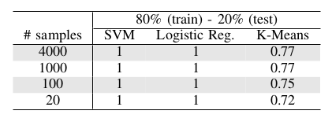
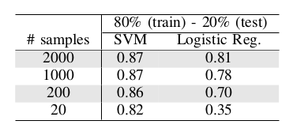

# [Unmasking DeepFake with simple Features](https://arxiv.org/abs/1905.12534)

This repository provides the official Python implementation of Unmasking DeepFake with simple Features. 

 
Overview of the pipeline used in our approach. It contains two main blocks, a pre-processing where the input istransformed to a more convenient domain and a 
training block, where a classifier uses the new transformed features to determine whether the face is real or not. Notice that input images are grey-scaled 
before DFT.

## Dependencies
Tested on Python 3.6.x.
* [NumPy](http://www.numpy.org/) (1.16.2)
* [Opencv](https://opencv.org/opencv-4-0/) (4.0.0)
* [Matplotlib](https://matplotlib.org/) (3.1.1)


## Detection Faces-HQ
To the best of our knowledge, no public dataset gathers images containing both artificially and real faces, therefore, we have created our own called Faces-HQ.
In order to have a sufficient variety of faces, we have chosen to download and label, images available from [CelebA-HQ dataset](https://arxiv.org/abs/1710.10196),
[Flickr-Faces-HQ dataset](https://arxiv.org/abs/1812.04948), [100K Facesproject](https://generated.photos/) and [www.thispersondoesnotexist.com](www.thispersondoesnotexist.com). 
In total, we have collected 40K high quality images being half of them real and the other half fake faces, achieving in this manner a balanced dataset.

Click [here](/Experiments_Faces-HQ) to go the experiments on Faces-HQ.

### Results

<b>Faces-HQ dataset.</b>
Test accuracy using SVM, logistic regression and k-means classifier under different data settings.
 

## Detection DeepFakeDetection (FaceForensics++)
 [FaceForensics++](https://github.com/ondyari/FaceForensics) is a forensics dataset consisting of video sequences that have been modified with
different automated face manipulation methods. Additionally,it is hosting DeepFakeDetection Dataset. In particular, this dataset contains 363 original
sequences from 28 paid actors in 16 different scenes as well as over 3000 manipulated videos using DeepFakes and their corresponding binary masks.
All videos contain a trackable mostly frontal face without occlusions which enables automated tampering methods to generate realistic forgeries.

Click [here](/Experiments_DeepFakeDetection) to go the experiments on DeepFakeDetection.

### Results

<b>DeepFakeDetection dataset.</b>
Test accuracy using SVM and logistic regression classifier under different data settings.



## Datasets Faces-HQ

This repo uses and combines several datasets to form Faces-HQ:

 

>We take 10K samples from [CelebA-HQ dataset](https://arxiv.org/abs/1710.10196). 

>We take 10K samples from [Flickr-Faces-HQ dataset](https://arxiv.org/abs/1812.04948)
and we convert to JPEG format.
 
>We take 10K samples from [www.thispersondoesnotexist.com](www.thispersondoesnotexist.com) uisng this 
[script](https://github.com/rayheffer/tpdne/blob/master/tpdne.sh)

>We take 10K samples from [100K Facesproject](https://generated.photos/).


### Citation
If this work is useful for your research, please cite our [paper](https://arxiv.org/abs/1905.12534):
```
@article{durall2019dropgan,
  title={Stabilizing GANs with Octave Convolutions},
  author={Durall, Ricard and Pfreundt, Franz-Josef and Keuper, Janis},
  journal={arXiv preprint arXiv:1905.12534},
  year={2019}
}
```
