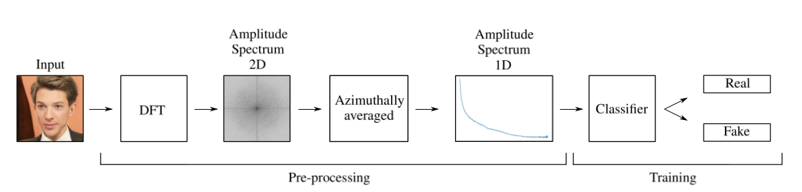
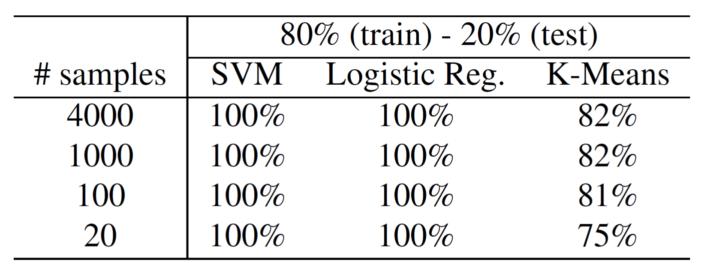
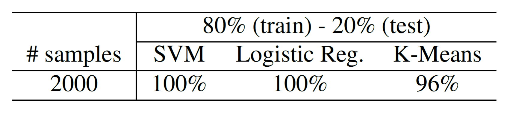
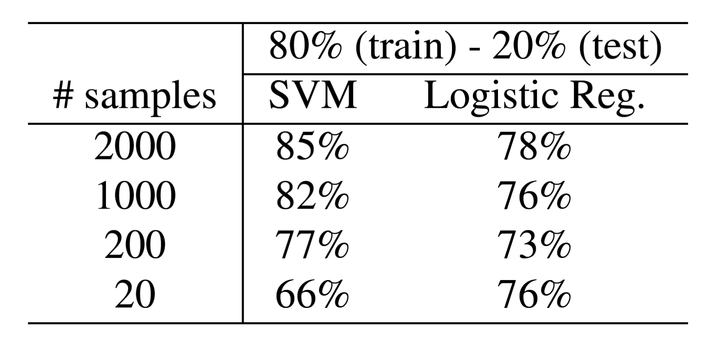
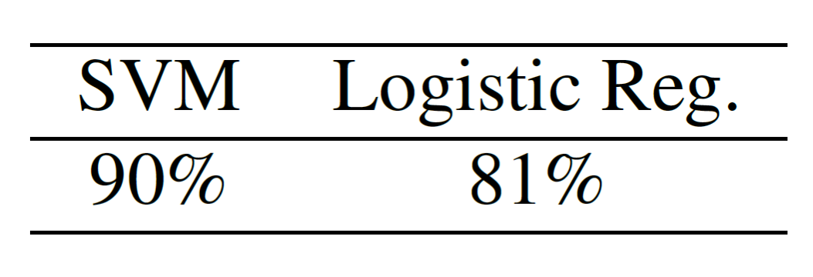
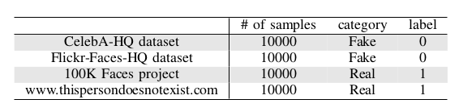

# [Unmasking DeepFake with simple Features](https://arxiv.org/abs/1911.00686)

This repository provides the official Python implementation of Unmasking DeepFake with simple Features (Paper: [https://arxiv.org/abs/1911.00686](https://arxiv.org/abs/1911.00686)).



Overview of the pipeline used in our approach. It contains two main blocks, a pre-processing where the input istransformed to a more convenient domain and a 
training block, where a classifier uses the new transformed features to determine whether the face is real or not. Notice that input images are grey-scaled 
before DFT.

## Dependencies
Tested on Python 3.6.x.
* [NumPy](http://www.numpy.org/) (1.16.2)
* [Opencv](https://opencv.org/opencv-4-0/) (4.0.0)
* [Matplotlib](https://matplotlib.org/) (3.1.1)


## Detection Faces-HQ 
To the best of our knowledge, no public dataset gathers images containing both artificially and real faces, therefore, we have created our own called Faces-HQ.
In order to have a sufficient variety of faces, we have chosen to download and label, images available from [CelebA-HQ dataset](https://arxiv.org/abs/1710.10196),
[Flickr-Faces-HQ dataset](https://arxiv.org/abs/1812.04948), [100K Facesproject](https://generated.photos/) and [www.thispersondoesnotexist.com](www.thispersondoesnotexist.com). 
In total, we have collected 40K high quality images being half of them real and the other half fake faces, achieving in this manner a balanced dataset.

Click [here](/Experiments_Faces-HQ) to go the experiments on Faces-HQ.

### Results


<b>Faces-HQ dataset.</b>
Test accuracy using SVM, logistic regression and k-means classifier under different data settings.

<p align='center'>  
    
</p>


### Detection CelebA
 [CelebA](http://mmlab.ie.cuhk.edu.hk/projects/CelebA.html) CelebFaces Attributes Dataset (CelebA) is a large-scale face attributes dataset with more than 
200K celebrity images, each with 40 attribute annotations. The images in this dataset cover large pose variations and background clutter. CelebA has large 
diversities, large quantities, and rich annotations

Click [here](/Experiments_CelebA) to go the experiments on CelebA.

### Results
<p align='center'>  
    
</p>


## Detection DeepFakeDetection (FaceForensics++)
 [FaceForensics++](https://github.com/ondyari/FaceForensics) is a forensics dataset consisting of video sequences that have been modified with
different automated face manipulation methods. Additionally,it is hosting DeepFakeDetection Dataset. In particular, this dataset contains 363 original
sequences from 28 paid actors in 16 different scenes as well as over 3000 manipulated videos using DeepFakes and their corresponding binary masks.
All videos contain a trackable mostly frontal face without occlusions which enables automated tampering methods to generate realistic forgeries.

Click [here](/Experiments_DeepFakeDetection) to go the experiments on DeepFakeDetection.

### Results

<b>DeepFakeDetection dataset.</b>
<p><i>Results based on frames.<i></p>
<p>Test accuracy using SVM and logistic regression classifier under different data settings.</p>
<p align='center'>  
    
</p>


<p><i>Results based on videos. (We apply a simple majority vote over the single frame classifications).<i></p>
<p>Test accuracy using SVM and logistic regression classifier.</p>
<p align='center'>  
    
</p>


## Datasets Faces-HQ 

This repo uses and combines several datasets to form Faces-HQ:



>We take 10K samples from [CelebA-HQ dataset](https://arxiv.org/abs/1710.10196). 

>We take 10K samples from [Flickr-Faces-HQ dataset](https://arxiv.org/abs/1812.04948)
and we convert to JPEG format.
 
>We take 10K samples from [www.thispersondoesnotexist.com](www.thispersondoesnotexist.com) uisng this 
[script](https://github.com/rayheffer/tpdne/blob/master/tpdne.sh)

>We take 10K samples from [100K Facesproject](https://generated.photos/).

### Download full (19GB) Faces-HQ data set: [https://cutt.ly/6enDLYG](https://cutt.ly/6enDLYG)


###  Citation
If this work is useful for your research, please cite our [paper](https://arxiv.org/abs/1911.00686):
```
@misc{durall2019unmasking,
    title={Unmasking DeepFakes with simple Features},
    author={Ricard Durall and Margret Keuper and Franz-Josef Pfreundt and Janis Keuper},
    year={2019},
    eprint={1911.00686},
    archivePrefix={arXiv},
    primaryClass={cs.LG}
}
```

## Some notes on data pre-processing
Some users have difficulties to get the deteection working on new data sets. Here are some remarks:
* For complex scenes, you need to run a feace detection first! Our approach will not work if the face/fake is not the dominant part of the input. Try to capture the inner parts of the faces without a lot of background... 
* Any re-sampling/re-scaling of the input images might distort the frequency spectrum: Do NOT resize the images, resize the spectra afterwards! Also: some prominent face detectors do resizing, don't use them if you can't turn it off.
* Use square input images (non square image might distort the radial sampling)
* Plot the spectra of your input data to check if they show the charaecteristic propoerties
* Our approach might not work on videos/images that have been compressed to a large extend (impacts the spectrum). 

# Follow-up work (CVPR Paper)
Following this pre-print, we have a CVPR 2020 paper, looking into the theory of spectral distortions by GANs and a way to fix this. 

* Pre-Print: [Watch your Up-Convolution: CNN Based Generative Deep Neural Networks are Failing to Reproduce Spectral Distributions](https://arxiv.org/abs/2003.01826)
* [GitHub Repo](https://github.com/cc-hpc-itwm/UpConv)
